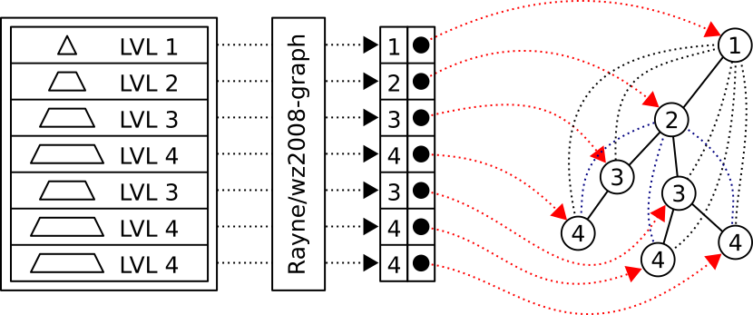

# Rayne/wz2008-graph

`Rayne/wz2008-graph` parses the "Classification of Economic Activities"
issued by the Statistisches Bundesamt.
It builds multiple hierarchically structured
and object oriented in-memory trees
from flat file structures with implicit hierarchy.

[](https://packagist.org/packages/rayne/wz2008-graph)
[](https://packagist.org/packages/rayne/wz2008-graph)
[](https://travis-ci.org/Rayne/wz2008-graph)
[](https://scrutinizer-ci.com/g/rayne/wz2008-graph/?branch=master)
[](https://scrutinizer-ci.com/g/rayne/wz2008-graph/?branch=master)
[](https://packagist.org/packages/rayne/wz2008-graph)



([English documentation below.](#setup))

## Paketbeschreibung (German)

Diese Bibliothek extrahiert die implizit vorliegende hierarchische Branchen-Struktur
aus der *Klassifikation der Wirtschaftszweige, Ausgabe 2008 (WZ 2008)*.
Als Daten-Grundlage wird die vollständige Klassifikation als XML-Datei genutzt.

Die jeweils aktuelle XML-Datei ist nicht Teil der Bibliothek
und muss zuvor vom
[Klassifikationsserver](https://www.klassifikationsserver.de/klassService/index.jsp?variant=wz2008)
heruntergeladen werden.
Der relevante Download ist etwa 1 MB groß
und befindet sich in der
[Download-Matrix](https://www.klassifikationsserver.de/klassService/index.jsp?variant=wz2008)
an folgender Position:

```
("Klassifikation komplett", "XML (Claset)")
```

Die Unit-Tests nutzen zur Zeit die Version vom `29.07.2016 12:15:37 (GMT+0200)`.
Die Test-Datei wird nur dann aktualisiert, wenn es für die Tests notwendig ist.
Sie befindet sich in `/assets/WZ2008-2016-07-29-Classification_(complete).xml`.

> Die Klassifikation der Wirtschaftszweige, Ausgabe 2008 (WZ 2008), wurde unter intensiver Beteiligung von Datennutzern und Datenproduzenten in Verwaltung, Wirtschaft, Forschung und Gesellschaft geschaffen und dient dazu, die wirtschaftlichen Tätigkeiten von Unternehmen, Betrieben und anderen statistischen Einheiten in allen amtlichen Statistiken einheitlich zu erfassen. Sie berücksichtigt die Vorgaben der statistischen Systematik der Wirtschaftszweige in der Europäischen Gemeinschaft (NACE Rev. 2), die mit der Verordnung (EG) Nr. 1893/2006 des Europäischen Parlaments und des Rates vom 20. Dezember 2006 (ABl. EG Nr. L 393 S. 1) veröffentlicht wurde und auf der International Standard Industrial Classification (ISIC Rev. 4) der Vereinten Nationen basiert. Die Zustimmung der Europäischen Kommission gemäß Artikel 4, Absatz 3, der oben genannten Verordnung liegt vor. 
>
> Die Anwendung der WZ 2008 für statistische Zwecke ergibt sich aus Artikel 8 der oben genannten Verordnung. Danach sind Statistiken, die sich auf vom 1. Januar 2008 an durchgeführte Wirtschaftstätigkeiten beziehen (Berichtsperiode), auf der Grundlage der NACE Rev. 2 (in Deutschland auf der Grundlage der WZ 2008) zu erstellen. Abweichend hiervon sind Konjunkturstatistiken gemäß der Verordnung (EG) Nr. 1165/98 und der Arbeitskostenindex gemäß der Verordnung (EG) Nr. 450/2003 ab dem 1. Januar 2009 auf Basis der NACE Rev. 2 (in Deutschland auf Basis der WZ 2008) zu erstellen. Die Anwendung ab 2008/2009 gilt nicht für folgende Statistiken: Statistiken der Volkswirtschaftlichen Gesamtrechnungen gemäß der Verordnung (EG) Nr. 2223/96, die Landwirtschaftliche Gesamtrechnung gemäß der Verordnung (EG) Nr. 138/2004 und Statistiken der Zahlungsbilanz, des internationalen Dienstleistungsverkehrs und der Direktinvestitionen gemäß der Verordnung (EG) Nr. 184/2005. Diese Statistiken wenden die NACE Rev. 2 / WZ 2008 ab einem späteren Zeitpunkt an.
>
> Quelle: https://www.klassifikationsserver.de/klassService/index.jsp?variant=wz2008

# Dependencies

## Production

* PHP 5.6 or better

## Development

* Composer
* Git
* PHPUnit

# Licence

* The library is published under the [MIT licence](LICENSE).

* The test file `/assets/WZ2008-2016-07-29-Classification_(complete).xml`
  is intellectual property of the
  *Statistisches Bundesamt (Federal Statistical Office), Wiesbaden, Section „Classifications“*
  and only required for running the unit tests.

  ```
  File content: Classification (complete)
  Further information: https://www.klassifikationsserver.de/
  Copyright: © Statistisches Bundesamt, Wiesbaden 2008 Distribution (also in parts) permitted, provided that the source is mentioned.
  Owner: Issued by: Statistisches Bundesamt (Federal Statistical Office), Wiesbaden, Section „Classifications“, Phone.: 0611/75-2510, -2294, -2280, Fax: 0611/75-3953,  E-Mail: wz@destatis.de
  Type: 'ex' = Part of (see help of the classification server)
  ```

# Setup

After installing the library it's necessary to locate
and download the correct XML data set.

## Library (Composer)

[Download Composer](https://getcomposer.org/download) and install `rayne/wz2008-graph`.

	composer require rayne/wz2008-graph ~1.0

Set the `@dev` stability flag to install the latest development version.

	composer require rayne/wz2008-graph @dev

## Library (GIT)

Instead of using `Composer` it's also possible to use `GIT`
as no third party project is required.
Please have a look at the [Tests](#tests) chapter.

## Data Set

1.	Download the `WZ2008-20XX-XX-XX-Classification_(complete).xml` file

	1.	Visit [klassifikationsserver.de/klassService/index.jsp?variant=wz2008](https://klassifikationsserver.de/klassService/index.jsp?variant=wz2008)

	2.	Locate the `ZIP` download in the download matrix at position
 
		```
		("Klassifikation komplett", "XML (Claset)")
		```

	3.	Extract the downloaded `ZIP` file

2.	Proceed with the [Usage](#usage) chapter

# Tests

1.	Clone the repository

		git clone https://github.com/rayne/wz2008-graph.git

2.	Install the development dependencies

		composer install --dev

3.	Run the tests
 
		./vendor/bin/phpunit

# Usage

## Build hierarchical Records

```php
$file = 'WZ2008-2016-07-29-Classification_(complete).xml';
$parser = new WzClassificationFile($file);

/**
 * The parser result is an `WzItemCollection`.
 * It behaves like a specialized `WzItemInterface[]` array
 * with some additional methods.
 *
 * @var WzItemCollection|WzItemInterface[] $record
 */
$records = $parser->getRecords();
```

## Search Record by ID

```php
$id = '26.20.0';

/* @var WzItemCollection $records */
if ($records->has($id)) {
    /* @var WzItemInterface $record */
    $record = $records->get($id);
}
```

It's also possible to access the records like array values.

```php
/* @var WzItemCollection $records */
$record = $records['26.20.0'];
```

## Read Record ID

```php
/* @var WzItemInterface $record */
$record->getId();
```

## Traverse Records

It's possible to traverse parents and children
relative to a given `WzItemInterface` object.
Every item has a hierarchy level between `1` and `5`.
`WzItemInterface` provides the following human readable constants.

| DE          | EN       | Level | Constant                        |
|-------------|----------|-------|---------------------------------|
| Abschnitt   | Section  | 1     | `WzItemInterface::LEVEL_SECTION`  |
| Abteilung   | Division | 2     | `WzItemInterface::LEVEL_DIVISION` |
| Gruppe      | Group    | 3     | `WzItemInterface::LEVEL_GROUP`    |
| Klasse      | Class    | 4     | `WzItemInterface::LEVEL_CLASS`    |
| Unterklasse | Subclass | 5     | `WzItemInterface::LEVEL_SUBCLASS` |

### Traverse Parents

Fetch the direct parent or traverse one level up.

```php
/* @var WzItemInterface $record */
/* @var WzItemInterface|null $parent */
$parent = $record->getParent();
```

Fetch the parent on a specific level or move up to a specific level.

```php
/* @var WzItemInterface $record */
/* @var WzItemInterface|null $parent */
$parent = $record->getParent($record::LEVEL_SECTION);
```

### Traverse Children

Fetch all direct children.

```php
/* @var WzItemInterface $record */
/* @var WzItemInterface[] $children */
$children = $record->getChildren();
```

Fetch all children by a specific level.
Children on other levels are skipped.

```php
/* @var WzItemInterface $record */
/* @var WzItemInterface[] $children */
$children = $record->getChildrenByLevel($record::LEVEL_CLASS);
```

## Get translated Labels

`WzItemInterface` throws an `InvalidArgumentException`
when there isn't a translation for the given language code.
The official XML files are limited to `DE` and `EN`.

The `$langCode` of `WzItemInterface->getLabel($langCode)` is case-insensitive.

```php
/* @var WzItemInterface $record */
/* @var string $label */
$label = $record->getLabel('de');
```

Get all translated labels and their language codes.

```php
/* @var WzItemInterface $record */
/* @var string[] $labels */
$labels = $record->getLabels();
```

`WzItemInterface->getLabels()` returns simple
key (language code)
value (translated label)
maps.

```php
$labels = [
    'de' => 'Wirtschafts- und Arbeitgeberverbände',
    'en' => 'Activities of business and employers membership organisations',
];
```

## Get all Records by Level

Filter all records by level.

```php
/* @var WzItemCollection $records */
/* @var WzItemInterface[] $sections */
$sections = $records->getItemsByLevel(WzItemInterface::LEVEL_SECTION);
$sections = $records->getItemsByLevel(1);
```
